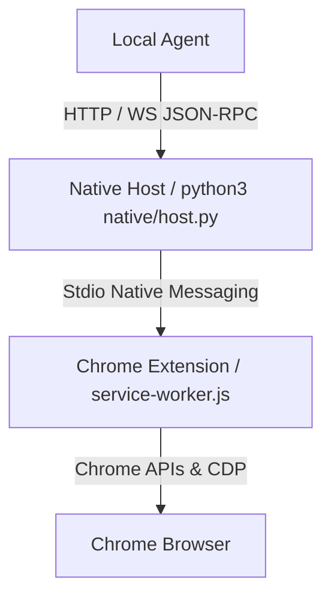

# Browser Agent Bridge

An unpacked Chrome extension plus Native Messaging host that exposes browser-control tools to a local agent through JSON-RPC over HTTP and WebSocket.

中文文档: [README.zh-CN.md](README.zh-CN.md)

## Table of Contents

- [Architecture](#architecture)
- [Features](#features)
- [Installation](#installation)
- [Authentication](#authentication)
- [Quick Start](#quick-start)
- [JSON-RPC API Summary](#json-rpc-api-summary)
- [Repository Paths](#repository-paths)
- [Security and Privacy](#security-and-privacy)

## Architecture

The extension contains no agent or model logic. It acts as a capability provider that connects local software to Chrome APIs and the Chrome DevTools Protocol.



- HTTP endpoint: `http://127.0.0.1:8765/rpc`
- WebSocket endpoint: `ws://127.0.0.1:8765/ws`

## Features

- Native Messaging integration through Chrome's stdio channel.
- Tab and session isolation using Chrome tab groups.
- High-fidelity page interaction through Chrome DevTools Protocol.
- Page inspection with visible text, screenshots, DOM snapshots, and accessibility trees.
- Event streaming for console and network activity.
- Workflow recording with input-redaction defaults.
- Optional visual overlays for tracing agent actions.

## Installation

Prerequisites:

- Google Chrome 116 or newer.
- Python 3 installed locally.

### Install via CRX (Release)

Each release includes a pre-built `extension.crx` file. Depending on your browser, you might be able to install it directly:

1. Download `extension.crx` from the latest release.
2. Open your browser's extension management page (`chrome://extensions`, `edge://extensions`, etc.).
3. Enable **Developer mode**.
4. Drag and drop the `extension.crx` file into the page.

> [!NOTE]
> **Google Chrome and Microsoft Edge** usually block the installation of `.crx` files that are not downloaded from their official web stores. If the installation is blocked or the extension is disabled immediately, please use the **Manual installation** (Load unpacked) method below. Other Chromium-based browsers may allow it.

After installing the extension, you still need to install the Native Messaging host. Make sure to copy the extension ID after installation and proceed to step 2 in the **Manual installation** section.

### Manual installation

Use this path when you are setting up the bridge yourself.

1. Load the unpacked extension in Chrome.
   - Open `chrome://extensions`.
   - Enable Developer mode.
   - Click Load unpacked and select this repository's `extension/` directory.
   - Copy the generated extension ID, for example `aodcpicfepmdmpfaflncbndcicoemdje`.

2. Install the Native Messaging host with that extension ID.

   macOS / Linux:

   ```bash
   ./scripts/install-native-host-unix.sh <extension-id>
   ```

   For another Chromium browser, pass `--browser chromium`, `--browser brave`, `--browser edge`, or `--browser all`.

   `scripts/install-native-host-macos.sh` is kept as a compatibility entrypoint and forwards to `install-native-host-unix.sh`.

   Windows:

   ```powershell
   powershell -ExecutionPolicy Bypass -File .\scripts\install-native-host-win.ps1 <extension-id>
   ```

   This installs for the current user through `HKCU`; administrator privileges are not required.

3. Verify the connection.
   - Reload the extension in `chrome://extensions`.
   - Open the extension side panel, accept the initial prompts, and click Start Bridge.
   - The side panel should show Connected.
   - Run `python3 scripts/doctor.py --skip-live` to verify platform-specific Native Messaging registration.

### Agent-assisted installation

Use this path when a local coding agent is setting up the bridge from this repository.

1. You still load the unpacked extension manually in Chrome:
   - Open `chrome://extensions`.
   - Enable Developer mode.
   - Load this repository's `extension/` directory.
   - The extension ID is stable because `extension/manifest.json` contains a fixed `key`.

2. Ask the agent to install the Browser Agent Bridge skill for future runs.

   For Codex-style agents, install by copying or symlinking this repository's skill directory into the agent skills directory:

   ```bash
   mkdir -p ~/.codex/skills
   ln -s "$(pwd)/skills/browser-agent-bridge" ~/.codex/skills/browser-agent-bridge
   ```

   The skill directory includes a `scripts/` snapshot copied from the repository's top-level `scripts/` directory. This snapshot is for offline reference and freshness checks; when this repository is available, the agent should execute the top-level `scripts/` files from the repository root.

   If the destination already exists, keep the existing copy only if it is current; otherwise replace it with this repository's `skills/browser-agent-bridge/` directory. This step writes outside the repository, so sandboxed agents should request elevated permission before doing it.

   Restart the agent session after installing the skill so it can discover the new `browser-agent-bridge` instructions.

3. Ask the agent to synchronize the skill script snapshot when repository scripts change:

   ```bash
   scripts/sync-skill-scripts.sh
   ```

   `python3 scripts/doctor.py --skip-live` warns with `skill.scripts.snapshot` when the skill snapshot is stale or missing. If the skill is already installed in `~/.codex/skills`, re-copy or re-link `skills/browser-agent-bridge/` after syncing.

4. Ask the agent to diagnose setup from the repository root:

   ```bash
   python3 scripts/doctor.py --skip-live
   ```

5. Ask the agent to read the stable extension ID from `extension/manifest.json` before installing the native host.

   The current stable ID is:

   ```text
   aodcpicfepmdmpfaflncbndcicoemdje
   ```

   The agent can confirm it locally with:

   ```bash
   python3 - <<'PY'
import base64
import hashlib
import json
from pathlib import Path
manifest = json.loads(Path("extension/manifest.json").read_text())
pub_key_der = base64.b64decode(manifest["key"])
sha = hashlib.sha256(pub_key_der).hexdigest()
extension_id = "".join(chr(int(char, 16) + 97) for char in sha[:32])
print(extension_id)
PY
   ```

6. If the native manifest, wrapper, or token file needs repair, the agent should run the platform installer from `scripts/` with the stable extension ID.

   macOS / Linux:

   ```bash
   ./scripts/install-native-host-unix.sh aodcpicfepmdmpfaflncbndcicoemdje
   ```

   Windows:

   ```powershell
   powershell -ExecutionPolicy Bypass -File .\scripts\install-native-host-win.ps1 aodcpicfepmdmpfaflncbndcicoemdje
   ```

   These installer scripts write outside the repository, such as `~/.browser-agent-bridge.env`, browser Native Messaging manifest directories, or the Windows `HKCU` registry key. In sandboxed agent environments, the agent should request elevated permission before running them.

7. Reload the extension in `chrome://extensions`, open the side panel, allow the initial extension permission prompts, and click Start Bridge.

8. Ask the agent to verify:

   ```bash
   python3 scripts/doctor.py --skip-live
   scripts/browser_bridge_client.py health
   ```

Platform diagnostics:

- macOS: user-level Chrome, Chromium, Brave, and Edge manifest paths under `~/Library/Application Support/.../NativeMessagingHosts/`.
- Linux: user-level Chrome, Chromium, Brave, and Edge manifest paths under `~/.config/.../NativeMessagingHosts/`.
- Windows: `HKCU:\Software\Google\Chrome\NativeMessagingHosts\com.local.browser_agent_bridge` and the manifest path referenced by that key's default value.

If doctor reports `package.freshness` as a warning, the release extension directory is older than the extension source files. This does not block local unpacked-extension development; rebuild the release package before distributing.

## Authentication

Local token authentication is enabled by default to prevent unauthorized local processes from controlling the browser.

The installer generates a token file:

- macOS/Linux: `~/.browser-agent-bridge.env`
- Windows: `%USERPROFILE%\.browser-agent-bridge.env`

For shell commands on macOS/Linux:

```bash
source ~/.browser-agent-bridge.env
```

On Windows, the Python client auto-loads `%USERPROFILE%\.browser-agent-bridge.env`. For manual PowerShell calls:

```powershell
$env:BROWSER_AGENT_BRIDGE_TOKEN = (Get-Content "$env:USERPROFILE\.browser-agent-bridge.env" | Where-Object { $_ -like 'BROWSER_AGENT_BRIDGE_TOKEN=*' }).Split('=', 2)[1]
```

Authenticated HTTP and WebSocket calls must include:

```text
Authorization: Bearer <your-token>
```

## Quick Start

The easiest client is `BrowserBridgeClient` in `scripts/browser_bridge_client.py`. It auto-loads the default token file on macOS, Linux, and Windows.

### Manual use

```python
import sys
sys.path.append("./scripts")
from browser_bridge_client import BrowserBridgeClient

client = BrowserBridgeClient()

res = client.rpc("session.start", {"name": "Test Session", "url": "https://example.com"})
session_id = res["session"]["id"]
tab_id = res["tab"]["id"]

client.rpc("page.waitForLoad", {"tabId": tab_id})
text = client.rpc("page.readText", {"tabId": tab_id})
tree = client.rpc("page.accessibilityTree", {"tabId": tab_id})

client.rpc("session.stop", {"sessionId": session_id})
```

Direct HTTP example:

```bash
source ~/.browser-agent-bridge.env

curl -X POST http://127.0.0.1:8765/rpc \
  -H "Content-Type: application/json" \
  -H "Authorization: Bearer $BROWSER_AGENT_BRIDGE_TOKEN" \
  -d '{
    "jsonrpc": "2.0",
    "id": "get-tabs",
    "method": "tabs.list",
    "params": {}
  }'
```

Helper scripts:

```bash
python3 scripts/doctor.py
scripts/rpc.sh '{"jsonrpc":"2.0","id":"1","method":"tabs.list","params":{}}'
python3 scripts/browser_bridge_client.py health
python3 scripts/browser_bridge_client.py rpc tabs.list '{"query":{"active":true}}'
node scripts/ws-rpc.js --listen
```

### Agent use

After installation, an agent with the `browser-agent-bridge` skill installed can use the skill instructions plus the helper scripts instead of writing raw HTTP calls:

```bash
scripts/browser_bridge_client.py health
scripts/browser_bridge_client.py rpc tabs.list '{"query":{"active":true,"currentWindow":true}}'
scripts/browser_bridge_client.py rpc page.readText '{"tabId":123}'
```

For site-specific browsing work, the agent should:

1. Run `tabs.list` first to discover the active `tabId`.
2. Prefer read-only calls such as `page.readText`, `page.accessibilityTree`, and `dom.query`.
3. Use `page.executeJavaScript`, `dom.*`, or `computer.*` only when needed.
4. Respect runtime approval prompts. If the side panel is closed, the extension opens an approval popup.
5. Record reusable site selectors, waits, extraction logic, CSP needs, and pitfalls in `skills/browser-agent-bridge/references/site-patterns/{domain}.md`.

The local HTTP/WebSocket bridge is available only while the side panel bridge control is started. If the user clicks Stop Bridge, helper scripts such as `scripts/browser_bridge_client.py health` fail until the user clicks Start Bridge again.

## JSON-RPC API Summary

| Category | Method | Description |
| :--- | :--- | :--- |
| System | `extension.info` | Get extension version and configuration. |
| System | `extension.reload` | Reload the extension background. |
| System | `native.status` | Get native host process status. |
| Tabs | `tabs.list` | List browser tabs. |
| Tabs | `tabs.create` | Create a browser tab. |
| Tabs | `tabs.activate` | Activate and focus a tab. |
| Tabs | `tabs.close` | Close tabs. |
| Session | `session.start` | Create an isolated workspace group. |
| Session | `session.list` | List active sessions. |
| Session | `session.get` | Get session details. |
| Session | `session.stop` | Close a session workspace. |
| Page | `page.navigate` | Navigate to a URL. |
| Page | `page.readText` | Extract visible page text. |
| Page | `page.accessibilityTree` | Get a structured accessibility tree. |
| Page | `page.screenshot` | Capture a page screenshot. |
| Page | `page.domSnapshot` | Get a CDP DOM snapshot. |
| Interactive | `dom.click` | Click by CSS selector. |
| Interactive | `dom.type` | Type into a selector. |
| Interactive | `computer.click` | Click at viewport coordinates. |
| Interactive | `computer.key` | Send key combinations. |
| Interactive | `computer.scroll` | Scroll by pixel offsets. |
| Recording | `recording.start` | Start workflow recording. |
| Recording | `recording.stop` | Stop workflow recording. |

## Repository Paths

- Extension: `extension/`
- Native host: `native/host.py`
- Native manifest template: `native/com.local.browser_agent_bridge.json`
- macOS/Linux installer: `scripts/install-native-host-unix.sh`
- Legacy macOS entrypoint: `scripts/install-native-host-macos.sh`
- Windows installer: `scripts/install-native-host-win.ps1`
- Windows launcher: `native/host-wrapper.win.bat`
- Doctor: `scripts/doctor.py`
- Release builder: `scripts/build-release.sh`

## Security and Privacy

- Sensitive operations such as tab listing, tab closing, screenshots, script execution, synthetic page input/actions, downloads, and network logs require runtime approval. Operations scoped to Agent-managed tab groups are allowed without an extra runtime approval prompt.
- If the side panel is closed, sensitive calls trigger a Chrome notification and open an extension approval popup.
- The Native Messaging host is not started by default. Use Start Bridge in the side panel to run it, and Stop Bridge to disconnect it and pause automatic reconnects.
- Workflow recordings redact typed text by default unless `includeText: true` is explicitly used.
- The default policy blocks automation on `chrome://*`, `chrome-extension://*`, and Chrome Web Store pages.
