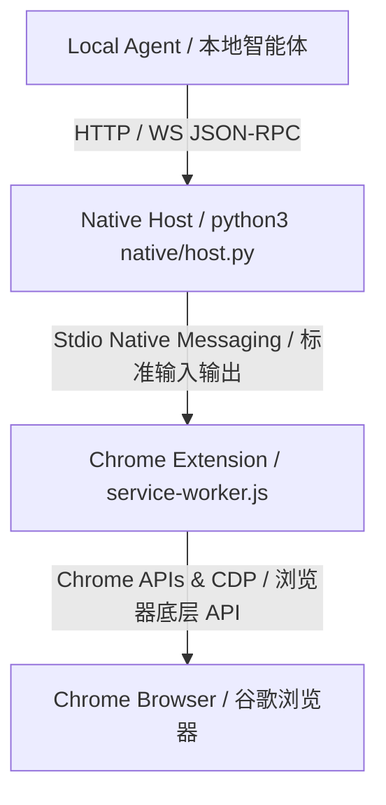

# Browser Agent Bridge (浏览器 Agent 桥接器)

An unpacked Chrome extension plus Native Messaging host that exposes high-fidelity browser-control tools to a local agent through JSON-RPC over HTTP and WebSocket.

这是一个未打包的 Chrome 浏览器插件及原生消息传递（Native Messaging）宿主程序。它通过 HTTP 和 WebSocket 上的 JSON-RPC 协议，向本地 Agent 暴露高保真的浏览器控制工具。

---

## 📖 Table of Contents / 目录
- [Architecture / 系统架构](#-architecture--系统架构)
- [Key Features / 主要特性](#-key-features--主要特性)
- [Installation / 安装指南](#-installation--安装指南)
- [Authentication / 本地安全认证](#-authentication--本地安全认证)
- [Quick Start & Examples / 快速上手与示例](#-quick-start--examples--快速上手与示例)
- [JSON-RPC API Reference / 接口参考](#-json-rpc-api-reference--接口参考)
- [Security & Privacy / 安全与隐私](#-security--privacy--安全与隐私)

---

## 📐 Architecture / 系统架构

The extension acts as a capabilities provider without containing any agent or model logic. It bridges local software to Chrome's internals:

该插件本身不包含任何 Agent 或模型逻辑，它作为一个纯粹的能力提供者，将本地软件与 Chrome 内部机制相连接：



- **HTTP Endpoint**: `http://127.0.0.1:8765/rpc` (For one-shot commands / 用于单次调用)
- **WebSocket Endpoint**: `ws://127.0.0.1:8765/ws` (For long-lived sessions and stream events / 用于长连接和事件流推送)

---

## 🌟 Key Features / 主要特性

- **Native Integration / 原生连接**: Fast and reliable communication via Chrome Native Messaging stdio channel.
- **Tab & Session Isolation / 标签与会话隔离**: Clean sandbox workspace management utilizing Chrome Tab Groups.
- **High-Fidelity Interaction / 高保真页面控制**: Perform clicks, drag-and-drop, scroll, and key combinations via Chrome DevTools Protocol (CDP).
- **Page Inspection / 页面状态感知**: Read full visible texts, capture screenshots, extract DOM snapshots, and retrieve structured accessibility trees.
- **Event Streaming / 实时事件缓冲**: Real-time buffering and access to page console logs and network events.
- **Workflow Recording / 交互录制归档**: Record browser interactions with automatic input-redaction policies to protect passwords and sensitive data.
- **Visual Overlays / 视觉交互高亮**: Dynamic visual indicators overlaid on active elements to trace Agent behavior.

---

## 🛠 Installation / 安装指南

### Prerequisites / 前置条件
- Google Chrome browser (version 116+)
- Python 3.x installed locally

### Step-by-Step Setup / 步骤说明

1. **Load Unpacked Extension / 加载未打包插件**
   - Open Chrome and navigate to `chrome://extensions`.
   - Enable **Developer mode** (右上角开启“开发者模式”).
   - Click **Load unpacked** (点击“加载已解压的扩展程序”) and select the `extension/` directory of this repository.
   - Copy the generated **Extension ID** (复制生成出的插件 ID，例如：`aodcpicfepmdmpfaflncbndcicoemdje`).

2. **Install Native Messaging Host / 安装原生消息宿主**
   Run the installation script with your Extension ID as the argument:
   
   使用复制的插件 ID 作为参数运行以下安装脚本：
   ```bash
   ./scripts/install-native-host-macos.sh <extension-id>
   ```

3. **Verify Connection / 验证连接**
   - Reload the extension in `chrome://extensions`.
   - Open the extension side panel. It should display **Connected / 已连接**.

---

## 🔒 Authentication / 本地安全认证

For security, local token authentication is enabled by default to prevent unauthorized local processes from hijacking your browser.

出于安全考虑，系统默认启用了本地 Token 认证，防止本地其他未授权进程篡改或劫持您的浏览器。

> [!IMPORTANT]
> The installation script automatically generates a secure token and saves it in `~/.browser-agent-bridge.env`.
> 
> 安装脚本会自动生成一个安全的随机 Token 并保存在本地的 `~/.browser-agent-bridge.env` 配置文件中。

To execute scripts or client tools, make sure to load this environment file:

运行脚本或客户端工具前，请确保已加载此环境变量文件：
```bash
source ~/.browser-agent-bridge.env
```

All API requests must include the Token in the HTTP/WebSocket headers:

所有的 API 请求都必须在 HTTP/WebSocket 请求头中包含该 Token：
```text
Authorization: Bearer <your-token-here>
```

---

## 🚀 Quick Start & Examples / 快速上手与示例

### Shell RPC Commands / 终端命令行调用
You can use the built-in helper scripts to quickly execute actions.

你可以使用内置的助手脚本来快速执行命令：

#### 1. List active tabs / 获取当前活跃标签页
```bash
scripts/rpc.sh '{"jsonrpc":"2.0","id":"1","method":"tabs.list","params":{"query":{"active":true}}}'
```

#### 2. Create a new tab / 新建标签页
```bash
scripts/rpc.sh '{"jsonrpc":"2.0","id":"2","method":"tabs.create","params":{"url":"https://example.com"}}'
```

#### 3. Read visible page text / 读取当前页面文本
```bash
scripts/rpc.sh '{"jsonrpc":"2.0","id":"3","method":"page.readText","params":{"tabId":123}}'
```

#### 4. Run Doctor Diagnostics / 运行系统诊断
Verify if your local environment is correctly configured:

验证您的本地环境配置是否正确：
```bash
python3 scripts/doctor.py
```

---

## 📡 JSON-RPC API Reference / 接口参考

| Category / 分类 | Method / 接口方法 | Description / 说明 |
| :--- | :--- | :--- |
| **System / 系统** | `extension.info` | Get extension version and configuration. / 获取插件版本与配置。 |
| | `extension.reload` | Force reload the extension background. / 强制重载插件后台。 |
| | `native.status` | Get Native host process status. / 获取 Native 进程运行状态。 |
| **Tabs / 标签页** | `tabs.list` | List open browser tabs. / 列出当前浏览器打开的标签页。 |
| | `tabs.create` | Create a new browser tab. / 打开新的标签页。 |
| | `tabs.activate` | Set target tab to active focus. / 激活并聚焦指定标签页。 |
| | `tabs.close` | Close specified tab(s). / 关闭指定的标签页。 |
| **Session / 会话** | `session.start` | Initialize an isolated workspace group. / 创建并初始化一个隔离的会话组。 |
| | `session.list` | List active workspace sessions. / 列出所有活跃的会话。 |
| | `session.get` | Get session details and its tab list. / 获取特定会话详情及标签。 |
| | `session.stop` | Close and teardown a session workspace. / 关闭会话并清除对应工作区。 |
| **Page / 页面动作** | `page.navigate` | Navigate to a specific URL. / 跳转至指定网址。 |
| | `page.readText` | Extract all visible text from the page. / 读取并提取页面上的可视文本。 |
| | `page.accessibilityTree` | Fetch structured clean accessibility tree. / 获取格式化的树状无障碍树。 |
| | `page.screenshot` | Take a high-resolution screenshot. / 对当前可视视口进行高解析度截图。 |
| | `page.domSnapshot` | Retrieve a structured CDP DOM snapshot. / 获取完整的 CDP 结构化 DOM 快照。 |
| **Interactive / 控制**| `dom.click` | Click on an element by its CSS selector. / 通过 CSS 选择器点击网页元素。 |
| | `dom.type` | Insert text into a specific selector. / 通过选择器向输入框内输入文本。 |
| | `computer.click` | Perform click at exact coordinate. / 在指定的屏幕坐标进行鼠标点击。 |
| | `computer.key` | Send keyboard stroke combinations. / 发送组合键盘按键（如 `Ctrl+A`）。 |
| | `computer.scroll` | Scroll by specific pixel offsets. / 按照像素偏移量进行页面滚动。 |
| **Privacy / 录制** | `recording.start` | Start recording user actions. / 开始录制用户与 Agent 操作流程。 |
| | `recording.stop` | Stop current recording session. / 停止并归档当前的录制。 |

---

## 🛡 Security & Privacy / 安全与隐私

- **Sensitive Operations Approval / 敏感操作交互授权**: 
  Actions involving tab listing, screenshot capture, file downloads, or network logs interception require user approval via the side panel. If the side panel is closed, requests will gracefully fail with a prompt asking the user to open it.
  
  涉及标签页列表、截图、文件下载或网络日志拦截等敏感操作时，系统会在侧边栏中弹窗提示用户授权。若侧边栏未打开，操作将被拦截并提示用户开启侧边栏进行确认。

- **Input Redaction / 输入脱敏机制**:
  To protect private data, keyboard entries and typed text are automatically redacted in the workflow recordings unless `includeText: true` is explicitly granted when starting a recording session.
  
  系统默认对键入的字符及输入框内容进行遮蔽。除非在调用 `recording.start` 时显式指定 `includeText: true`，否则在录制流中所有输入细节都将作为 `redacted` 处理，防止密码或隐私泄露。

- **URL Access Control / 域名白名单策略**:
  The default security policy strictly blocks operations on system pages (e.g., `chrome://*`, `chrome-extension://*`, and Google Chrome Web Store).
  
  系统内置安全拦截名单，默认严格禁止对浏览器系统页面、插件后台页面、以及谷歌应用商店执行任何自动化操控。
