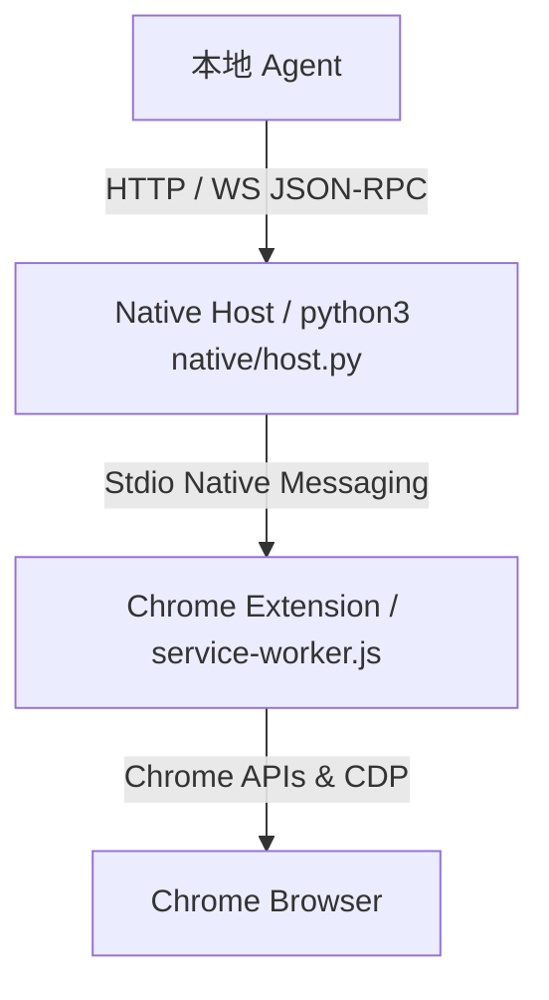

# Browser Agent Bridge

Browser Agent Bridge 是一个未打包的 Chrome 扩展和 Native Messaging 宿主程序。它通过 HTTP 和 WebSocket 上的 JSON-RPC，把浏览器控制能力暴露给本地 Agent。

English documentation: [README.md](README.md)

## 目录

- [系统架构](#系统架构)
- [主要特性](#主要特性)
- [安装](#安装)
- [本地认证](#本地认证)
- [快速开始](#快速开始)
- [JSON-RPC 接口摘要](#json-rpc-接口摘要)
- [项目路径](#项目路径)
- [安全与隐私](#安全与隐私)

## 系统架构

扩展本身不包含 Agent 或模型逻辑。它只作为能力提供层，把本地程序连接到 Chrome API 和 Chrome DevTools Protocol。



- HTTP 接口：`http://127.0.0.1:8765/rpc`
- WebSocket 接口：`ws://127.0.0.1:8765/ws`

## 主要特性

- 通过 Chrome Native Messaging stdio 通道进行原生通信。
- 使用 Chrome Tab Groups 做标签页和会话隔离。
- 通过 Chrome DevTools Protocol 执行高保真页面交互。
- 支持读取可见文本、截图、DOM 快照和无障碍树。
- 支持页面 console 和 network 事件流。
- 支持工作流录制，并默认对输入内容脱敏。
- 支持可视化高亮，用于追踪 Agent 操作。

## 安装

前置条件：

- Google Chrome 116 或更高版本。
- 本地已安装 Python 3。

安装步骤：

1. 加载未打包扩展。
   - 打开 `chrome://extensions`。
   - 开启 Developer mode。
   - 点击 Load unpacked，选择本仓库的 `extension/` 目录。
   - 复制生成的扩展 ID，例如 `aodcpicfepmdmpfaflncbndcicoemdje`。

2. 用该扩展 ID 安装 Native Messaging host。

   macOS / Linux：

   ```bash
   ./scripts/install-native-host-unix.sh <extension-id>
   ```

   如果要注册到其他 Chromium 浏览器，可以传入 `--browser chromium`、`--browser brave`、`--browser edge` 或 `--browser all`。

   `scripts/install-native-host-macos.sh` 只是兼容入口，会转发到 `install-native-host-unix.sh`。

   Windows：

   ```powershell
   powershell -ExecutionPolicy Bypass -File .\scripts\install-native-host-win.ps1 <extension-id>
   ```

   该脚本通过 `HKCU` 安装到当前用户，不需要管理员权限。

3. 验证连接。
   - 在 `chrome://extensions` 中重新加载扩展。
   - 打开扩展侧边栏，状态应显示 Connected。
   - 运行 `python3 scripts/doctor.py --skip-live` 检查平台相关的 Native Messaging 注册状态。

平台诊断：

- macOS：检查 `~/Library/Application Support/.../NativeMessagingHosts/` 下 Chrome、Chromium、Brave、Edge 的用户级 manifest 路径。
- Linux：检查 `~/.config/.../NativeMessagingHosts/` 下 Chrome、Chromium、Brave、Edge 的用户级 manifest 路径。
- Windows：检查 `HKCU:\Software\Google\Chrome\NativeMessagingHosts\com.local.browser_agent_bridge`，以及该注册表项默认值指向的 manifest 路径。

如果 doctor 报告 `package.freshness` warning，表示发布 zip 比扩展源码旧。这不影响本地加载未打包扩展开发；发布前重新构建 release 包即可。

## 本地认证

系统默认开启本地 token 认证，用于防止未授权的本地进程控制浏览器。

安装脚本会生成 token 文件：

- macOS/Linux：`~/.browser-agent-bridge.env`
- Windows：`%USERPROFILE%\.browser-agent-bridge.env`

macOS/Linux shell 命令可这样加载：

```bash
source ~/.browser-agent-bridge.env
```

Windows 下 Python client 会自动读取 `%USERPROFILE%\.browser-agent-bridge.env`。手动 PowerShell 调用可这样加载：

```powershell
$env:BROWSER_AGENT_BRIDGE_TOKEN = (Get-Content "$env:USERPROFILE\.browser-agent-bridge.env" | Where-Object { $_ -like 'BROWSER_AGENT_BRIDGE_TOKEN=*' }).Split('=', 2)[1]
```

通过 HTTP 或 WebSocket 调用认证接口时，需要包含：

```text
Authorization: Bearer <your-token>
```

## 快速开始

推荐使用 `scripts/browser_bridge_client.py` 中的 `BrowserBridgeClient`。它会在 macOS、Linux、Windows 上自动读取默认 token 文件。

```python
import sys
sys.path.append("./scripts")
from browser_bridge_client import BrowserBridgeClient

client = BrowserBridgeClient()

res = client.rpc("session.start", {"name": "Test Session", "url": "https://example.com"})
session_id = res["session"]["id"]
tab_id = res["tab"]["id"]

client.rpc("page.waitForLoad", {"tabId": tab_id})
text = client.rpc("page.readText", {"tabId": tab_id})
tree = client.rpc("page.accessibilityTree", {"tabId": tab_id})

client.rpc("session.stop", {"sessionId": session_id})
```

直接 HTTP 调用示例：

```bash
source ~/.browser-agent-bridge.env

curl -X POST http://127.0.0.1:8765/rpc \
  -H "Content-Type: application/json" \
  -H "Authorization: Bearer $BROWSER_AGENT_BRIDGE_TOKEN" \
  -d '{
    "jsonrpc": "2.0",
    "id": "get-tabs",
    "method": "tabs.list",
    "params": {}
  }'
```

内置辅助脚本：

```bash
python3 scripts/doctor.py
scripts/rpc.sh '{"jsonrpc":"2.0","id":"1","method":"tabs.list","params":{}}'
python3 scripts/browser_bridge_client.py health
python3 scripts/browser_bridge_client.py rpc tabs.list '{"query":{"active":true}}'
node scripts/ws-rpc.js --listen
```

## JSON-RPC 接口摘要

| 分类 | 方法 | 说明 |
| :--- | :--- | :--- |
| System | `extension.info` | 获取扩展版本和配置。 |
| System | `extension.reload` | 重新加载扩展后台。 |
| System | `native.status` | 获取 native host 进程状态。 |
| Tabs | `tabs.list` | 列出浏览器标签页。 |
| Tabs | `tabs.create` | 创建浏览器标签页。 |
| Tabs | `tabs.activate` | 激活并聚焦标签页。 |
| Tabs | `tabs.close` | 关闭标签页。 |
| Session | `session.start` | 创建隔离工作区。 |
| Session | `session.list` | 列出活跃会话。 |
| Session | `session.get` | 获取会话详情。 |
| Session | `session.stop` | 关闭会话工作区。 |
| Page | `page.navigate` | 导航到 URL。 |
| Page | `page.readText` | 提取页面可见文本。 |
| Page | `page.accessibilityTree` | 获取结构化无障碍树。 |
| Page | `page.screenshot` | 截取页面截图。 |
| Page | `page.domSnapshot` | 获取 CDP DOM 快照。 |
| Interactive | `dom.click` | 通过 CSS selector 点击。 |
| Interactive | `dom.type` | 向 selector 对应元素输入文本。 |
| Interactive | `computer.click` | 按视口坐标点击。 |
| Interactive | `computer.key` | 发送组合键。 |
| Interactive | `computer.scroll` | 按像素偏移滚动。 |
| Recording | `recording.start` | 开始工作流录制。 |
| Recording | `recording.stop` | 停止工作流录制。 |

## 项目路径

- 扩展目录：`extension/`
- Native host：`native/host.py`
- Native manifest 模板：`native/com.local.browser_agent_bridge.json`
- macOS/Linux 安装器：`scripts/install-native-host-unix.sh`
- 旧 macOS 兼容入口：`scripts/install-native-host-macos.sh`
- Windows 安装器：`scripts/install-native-host-win.ps1`
- Windows 启动器：`native/host-wrapper.win.bat`
- 诊断工具：`scripts/doctor.py`
- 发布包构建：`scripts/build-release.sh`

## 安全与隐私

- 标签页列表、截图、下载记录、网络日志等敏感操作需要运行时确认授权。
- 如果侧边栏未打开，敏感调用会触发 Chrome 通知，并打开扩展审批弹窗。
- 工作流录制默认会对输入文本脱敏，除非显式使用 `includeText: true`。
- 默认策略禁止自动化 `chrome://*`、`chrome-extension://*` 和 Chrome Web Store 页面。
